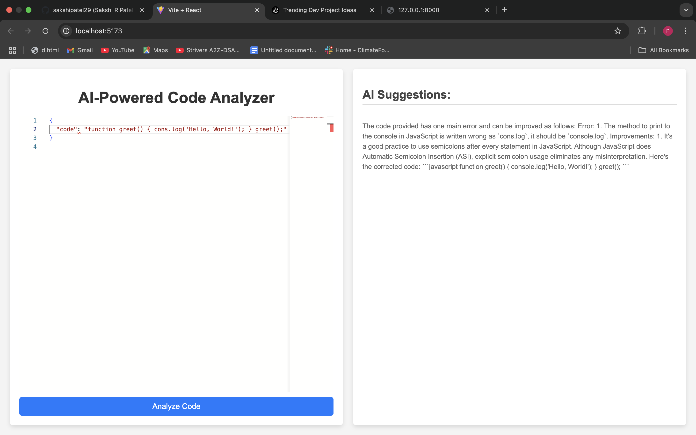

# AI Code Review



*An AI-powered code review tool leveraging FastAPI and React.*

## Overview

AI Code Review is a web application designed to analyze code snippets using OpenAI's GPT-4 model. It provides insightful suggestions and improvements for your code. The project is structured with a React frontend and a FastAPI backend.

## Features

- **Code Analysis**: Submit code snippets to receive AI-generated feedback.
- **Linting**: Ensure your code adheres to best practices.
- **Auto Documentation**: Generate comments and documentation for your code automatically.

## Project Structure


## Prerequisites

- **Node.js** (for the frontend)
- **Python 3.8+** (for the backend)
- **Docker** (for containerization)

## Setup Instructions

### Frontend

1. **Initialize the React App**:
   ```bash
   npx create-vite@latest ai-code-review --template react
   cd ai-code-review


2. #### Install Dependencies
    ```bash
    npm install
    npm install monaco-editor axios


### Backend

1. **Set Up the Virtual Environment**:
    ```bash
    mkdir backend && cd backend
    python -m venv venv
    source venv/bin/activate

2. #### Install Dependencies
    ```bash
    pip install fastapi uvicorn openai pydantic python-multipart
    pip install flask rope


#### Backend Dependencies Overview

- **fastapi**: A modern, fast (high-performance) web framework for building APIs with Python 3.6+ based on standard Python type hints.
- **uvicorn**: An ASGI server for FastAPI, providing high-performance capabilities.
- **openai**: A library to interact with OpenAI's GPT-4 model.
- **pydantic**: Data validation and settings management using Python type annotations.
- **python-multipart**: A module to handle file uploads in FastAPI.


 
uvicorn main:app --reload 